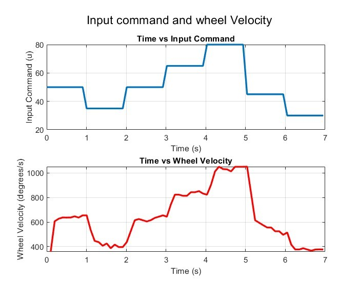
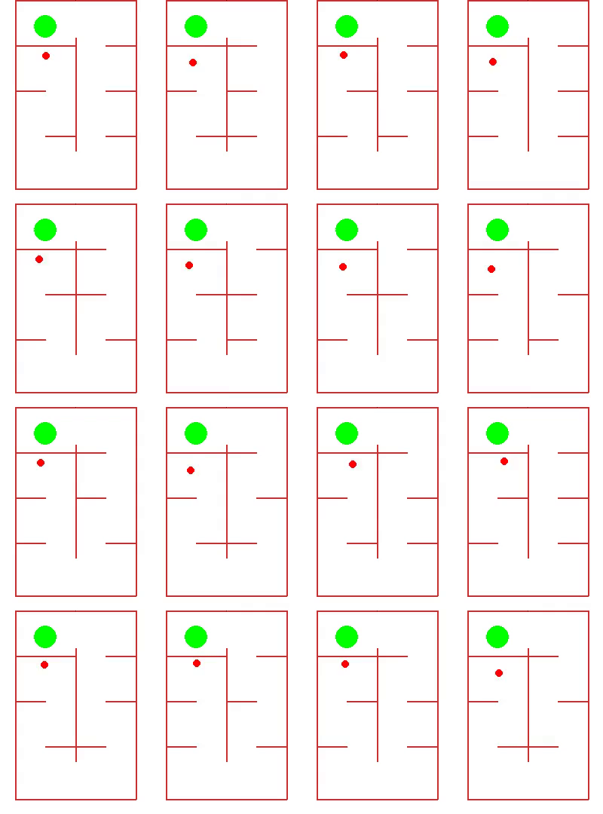
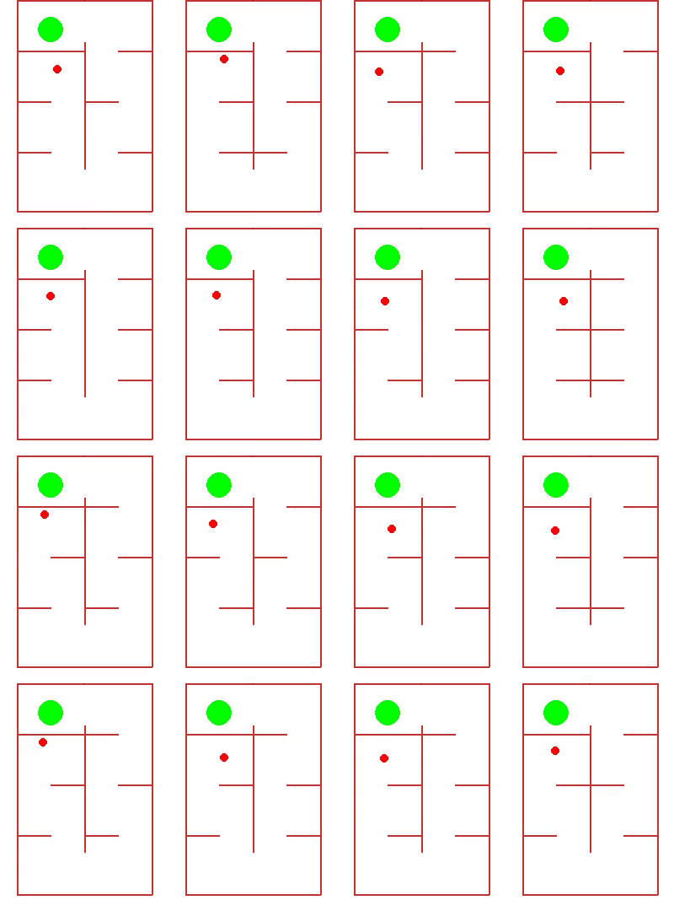
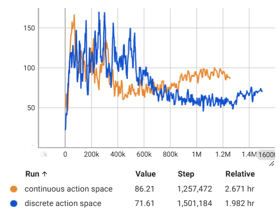
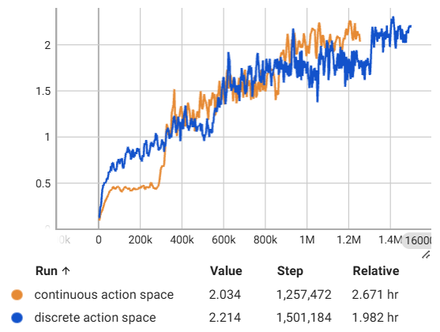

# Robot navigating custom Gym-environment 2D maze using reinforcement learning

This repository contains a Gymnasium environment used to train a RL agent to navigate a robot through a maze with randomized obstacles. 

The observation space consists of the laser range finder readings. The reward function consists of intermediate checkpoint rewards and an eventual goal reward. The episode is terminated after collision with an obstacle. 

The agent is trained with recurrent PPO.

There are two implementations of the environment: continuous action space and discrete action space. 

The agent outputs actions for the left and right wheel desired rotational velocities in the continuous action space environment. The robot in this project is based on a Lego Mindstorm robot. A simple dynamic model was obtained with the following step response test:

<div align="center">
    
    <br>
    <b>Mindstorm robot experiment</b>
</div>

## Results:
<div align='center'>
    <table>
    <tr>
        <td align="center">
        
        <br>
        <b>Discrete action space</b>
        </td>
        <td align="center">
        
        <br>
        <b>Continuous action space</b>
        </td>
    </tr>
    </table>
</div>
<div align='center'>
    <table>
    <tr>
        <td align="center">
        
        <br>
        <b>Average episode length</b>
        </td>
        <td align="center">
        
        <br>
        <b>Average episode reward</b>
        </td>
    </tr>
    </table>
</div>


## Branches:
- **rppo_checkpoints_lrf_obs_cont (main)** -- continuous action space + recurrent PPO + checkpoints reward func + only laser range finder observation space.
- **recurrent_checkpoints_lrf_obs (main)** -- discrete action space + recurrent PPO + checkpoints rewardfunc + only laser range finder observation space.
- **checkpoints_lrf_obs_cont** -- continuous action space + checkpoints reward func + only laser range finder observation space.
- **checkpoints_lrf_obs_disc** -- discrete action space + checkpoints reward func + only laser range finder observation space. 
- **checkpoints_rewardfunc_disc_actions** -- discrete action space + checkpoints rewardfunc.
- **lrf_obs_cont_model** -- continuous action space + only laser range finder observation space. 
- **lrf_obs_disc** -- discrete action space + only laser range finder observation space.
- **cont_action_space** -- basis for continuous action space environment.
- **discrete_action_space** -- basis for discrete action space environment.
#### inactive:
- **curriculum_learning_disc_actions** -- curriculum learning experiment.
- **curriculum_lrf_obs_disc** -- curriculum learning experiment.
- **normalized_observation_space** -- normalized observation space experiment.
- **recurrent_ppo** -- recurrent ppo experiment.
- **recurrent_curriculum_lrf_obs** -- recurrent PPO + curriculum experiment. 
- **checkpoints_recurrent_ppo** -- recurrent PPO + checkpoints reward func experiment. 
## Setup guide:
To enable rendering from docker container, type following in terminal: 
```bash
xhost +
```
To create Docker image:
```bash
cd mindstorm_project_rl
docker build -t gymnasium-env -f Dockerfile .
```
To run Docker image (change mounted volume):
```bash
docker run --rm -it --cpus=16 --memory=12G --name gymnasium-env -e DISPLAY=$DISPLAY -v /tmp/.X11-unix:/tmp/.X11-unix -v /c/Users/Desktop:/Desktop -p 6006:6006 gymnasium-env /bin/bash
```
To run tensorboard run the following from outside docker container terminal:
```bash
cd mindstorm_project_rl
tensorboard --logdir=logs
```
When running train.py, make sure n_envs does not exceed amount of logical processors on PC. 
